# Mermaid diagrams — research_core (raw, for Claude Design)

Extracted 25 diagrams from 13 notebooks in `research_core/`. Each notebook has an A. Inicio diagram (right after the title) and, where present, a B. Appendix diagram ("variable journey" section near the end).

Goal: re-style these as pre-rendered static images (GitHub does not render mermaid inside `.ipynb` markdown cells — see [[project_nb_refactor_sprint]] / tech debt). `0403_KMeans_Raw.ipynb` already went through this conversion as the pilot; these 25 are next.

## 0212_ETL_Big_Bang_pienzadb.ipynb

### A. Inicio

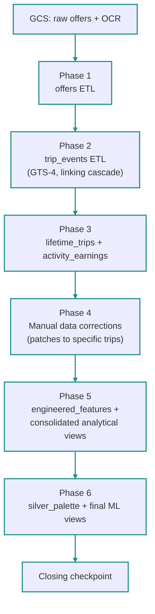
```mermaid
flowchart TD
    A["GCS: raw offers + OCR"] --> B["Phase 1\noffers ETL"]
    B --> C["Phase 2\ntrip_events ETL\n(GTS-4, linking cascade)"]
    C --> D["Phase 3\nlifetime_trips + activity_earnings"]
    D --> E["Phase 4\nManual data corrections\n(patches to specific trips)"]
    E --> F["Phase 5\nengineered_features +\nconsolidated analytical views"]
    F --> G["Phase 6\nsilver_palette + final ML views"]
    G --> H["Closing checkpoint"]

    classDef default stroke:#21918c,stroke-width:2px;
    linkStyle default stroke:#21918c,stroke-width:2px;
```

## 0305_EDA_Causal_Inference.ipynb

### A. Inicio

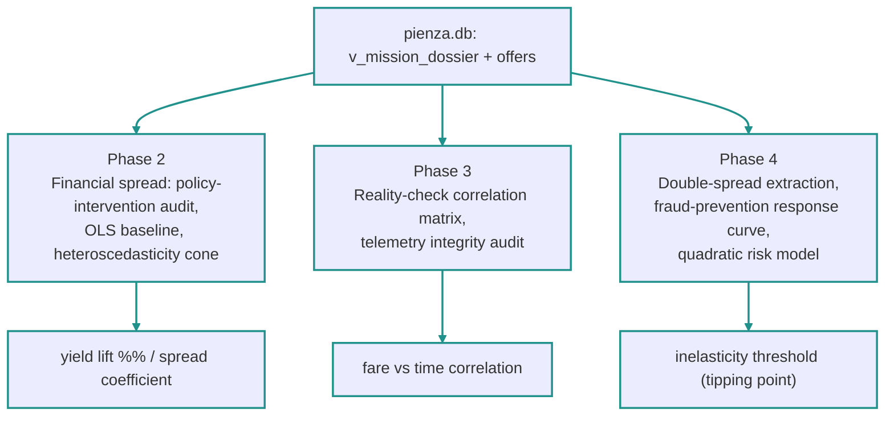
```mermaid
flowchart TD
    A["pienza.db: v_mission_dossier + offers"] --> B["Phase 2\nFinancial spread: policy-intervention audit,\nOLS baseline, heteroscedasticity cone"]
    A --> C["Phase 3\nReality-check correlation matrix,\ntelemetry integrity audit"]
    A --> D["Phase 4\nDouble-spread extraction,\nfraud-prevention response curve,\nquadratic risk model"]
    B --> E["yield lift %% / spread coefficient"]
    C --> F["fare vs time correlation"]
    D --> G["inelasticity threshold (tipping point)"]
    classDef default stroke:#21918c,stroke-width:2px;
    linkStyle default stroke:#21918c,stroke-width:2px;
```

### B. Appendix

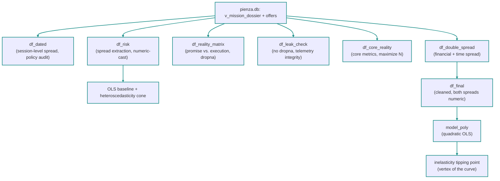
```mermaid
flowchart TD
    dossier["pienza.db: v_mission_dossier + offers"] --> df_dated["df_dated\n(session-level spread, policy audit)"]
    dossier --> df_risk["df_risk\n(spread extraction, numeric-cast)"]
    df_risk --> ols["OLS baseline + heteroscedasticity cone"]

    dossier --> df_reality_matrix["df_reality_matrix\n(promise vs. execution, dropna)"]
    dossier --> df_leak_check["df_leak_check\n(no dropna, telemetry integrity)"]
    dossier --> df_core["df_core_reality\n(core metrics, maximize N)"]

    dossier --> df_double["df_double_spread\n(financial + time spread)"]
    df_double --> df_final["df_final\n(cleaned, both spreads numeric)"]
    df_final --> model_poly["model_poly\n(quadratic OLS)"]
    model_poly --> tipping["inelasticity tipping point\n(vertex of the curve)"]

    classDef default stroke:#21918c,stroke-width:2px;
    linkStyle default stroke:#21918c,stroke-width:2px;
```

## 0307_EDA_Optimal_Stopping_Playbook.ipynb

### A. Inicio

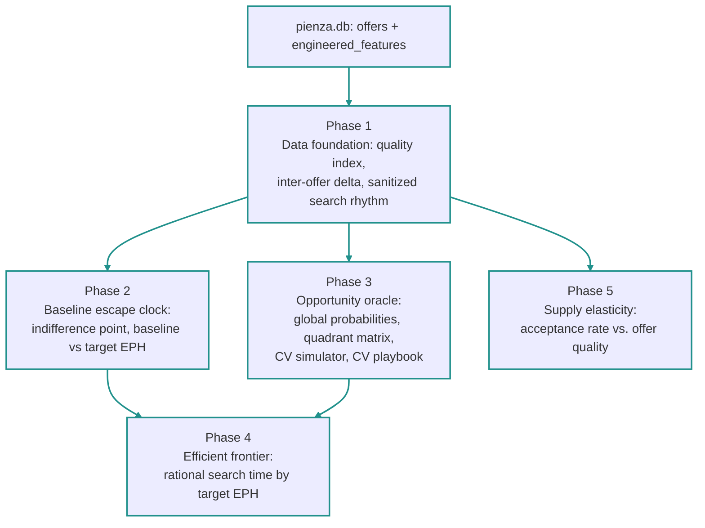
```mermaid
flowchart TD
    A["pienza.db: offers + engineered_features"] --> B["Phase 1\nData foundation: quality index,\ninter-offer delta, sanitized search rhythm"]
    B --> C["Phase 2\nBaseline escape clock:\nindifference point, baseline vs target EPH"]
    B --> D["Phase 3\nOpportunity oracle:\nglobal probabilities, quadrant matrix,\nCV simulator, CV playbook"]
    C --> E["Phase 4\nEfficient frontier:\nrational search time by target EPH"]
    D --> E
    B --> F["Phase 5\nSupply elasticity:\nacceptance rate vs. offer quality"]

    classDef default stroke:#21918c,stroke-width:2px;
    linkStyle default stroke:#21918c,stroke-width:2px;
```

### B. Appendix

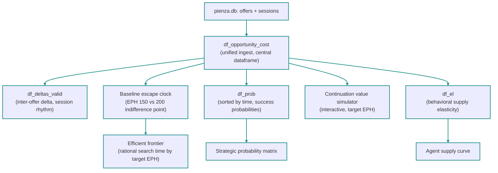
```mermaid
flowchart TD
    dossier["pienza.db: offers + sessions"] --> df_opp["df_opportunity_cost\n(unified ingest, central dataframe)"]
    df_opp --> df_deltas["df_deltas_valid\n(inter-offer delta, session rhythm)"]

    df_opp --> escape["Baseline escape clock\n(EPH 150 vs 200 indifference point)"]
    df_opp --> df_prob["df_prob\n(sorted by time, success probabilities)"]
    df_prob --> matrix["Strategic probability matrix"]
    df_opp --> simulator["Continuation value simulator\n(interactive, target EPH)"]

    escape --> frontier["Efficient frontier\n(rational search time by target EPH)"]
    df_opp --> df_el["df_el\n(behavioral supply elasticity)"]
    df_el --> supply["Agent supply curve"]

    classDef default stroke:#21918c,stroke-width:2px;
    linkStyle default stroke:#21918c,stroke-width:2px;
```

## 0407_Clustering_Paper_Streamlit.ipynb

### A. Inicio

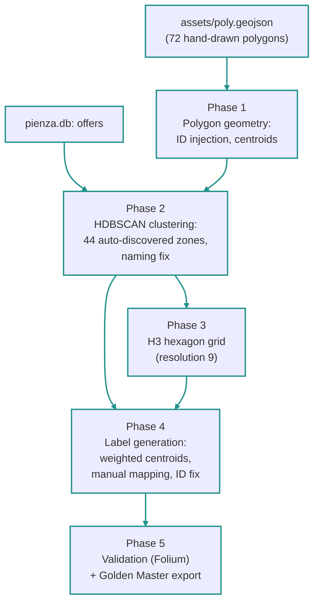
```mermaid
flowchart TD
    A["assets/poly.geojson\n(72 hand-drawn polygons)"] --> B["Phase 1\nPolygon geometry:\nID injection, centroids"]
    A2["pienza.db: offers"] --> C["Phase 2\nHDBSCAN clustering:\n44 auto-discovered zones,\nnaming fix"]
    B --> C
    C --> D["Phase 3\nH3 hexagon grid\n(resolution 9)"]
    C --> E["Phase 4\nLabel generation:\nweighted centroids,\nmanual mapping, ID fix"]
    D --> E
    E --> F["Phase 5\nValidation (Folium)\n+ Golden Master export"]

    classDef default stroke:#21918c,stroke-width:2px;
    linkStyle default stroke:#21918c,stroke-width:2px;
```

### B. Appendix

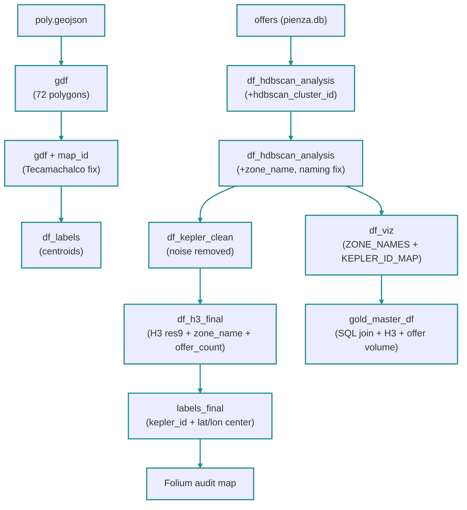
```mermaid
flowchart TD
    poly["poly.geojson"] --> gdf["gdf\n(72 polygons)"]
    gdf --> gdf_ids["gdf + map_id\n(Tecamachalco fix)"]
    gdf_ids --> df_labels["df_labels\n(centroids)"]

    offers["offers (pienza.db)"] --> df_hdbscan["df_hdbscan_analysis\n(+hdbscan_cluster_id)"]
    df_hdbscan --> df_hdbscan_named["df_hdbscan_analysis\n(+zone_name, naming fix)"]
    df_hdbscan_named --> df_kepler_clean["df_kepler_clean\n(noise removed)"]

    df_kepler_clean --> df_h3_final["df_h3_final\n(H3 res9 + zone_name + offer_count)"]
    df_h3_final --> labels_final["labels_final\n(kepler_id + lat/lon center)"]
    labels_final --> folium_map["Folium audit map"]

    df_hdbscan_named --> df_viz["df_viz\n(ZONE_NAMES + KEPLER_ID_MAP)"]
    df_viz --> gold_master["gold_master_df\n(SQL join + H3 + offer volume)"]

    classDef default stroke:#21918c,stroke-width:2px;
    linkStyle default stroke:#21918c,stroke-width:2px;
```

## 0509_WINNER_XGB_cascade_postablation.ipynb

### A. Inicio

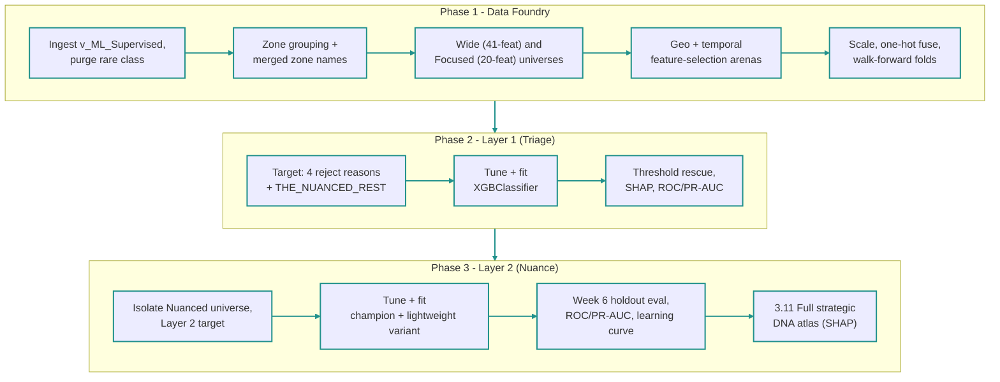
```mermaid
flowchart TD
    subgraph P1["Phase 1 - Data Foundry"]
        p1a["Ingest v_ML_Supervised,\npurge rare class"] --> p1b["Zone grouping +\nmerged zone names"]
        p1b --> p1c["Wide (41-feat) and\nFocused (20-feat) universes"]
        p1c --> p1d["Geo + temporal\nfeature-selection arenas"]
        p1d --> p1e["Scale, one-hot fuse,\nwalk-forward folds"]
    end

    subgraph P2["Phase 2 - Layer 1 (Triage)"]
        p2a["Target: 4 reject reasons\n+ THE_NUANCED_REST"] --> p2b["Tune + fit\nXGBClassifier"]
        p2b --> p2c["Threshold rescue,\nSHAP, ROC/PR-AUC"]
    end

    subgraph P3["Phase 3 - Layer 2 (Nuance)"]
        p3a["Isolate Nuanced universe,\nLayer 2 target"] --> p3b["Tune + fit\nchampion + lightweight variant"]
        p3b --> p3c["Week 6 holdout eval,\nROC/PR-AUC, learning curve"]
        p3c --> p3d["3.11 Full strategic\nDNA atlas (SHAP)"]
    end

    P1 --> P2 --> P3

    classDef default stroke:#21918c,stroke-width:2px;
    linkStyle default stroke:#21918c,stroke-width:2px;
```

### B. Appendix

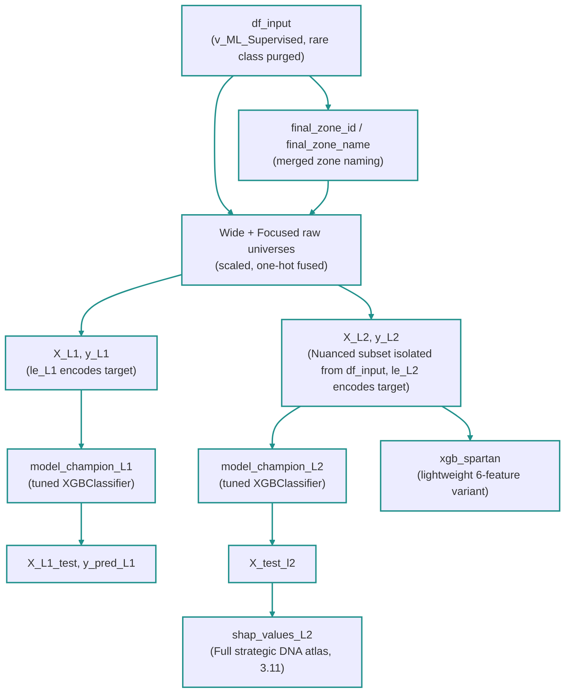
```mermaid
flowchart TD
    df_input["df_input\n(v_ML_Supervised, rare class purged)"] --> zones["final_zone_id / final_zone_name\n(merged zone naming)"]
    df_input --> features["Wide + Focused raw universes\n(scaled, one-hot fused)"]
    zones --> features

    features --> XL1["X_L1, y_L1\n(le_L1 encodes target)"]
    XL1 --> modelL1["model_champion_L1\n(tuned XGBClassifier)"]
    modelL1 --> predL1["X_L1_test, y_pred_L1"]

    features --> XL2["X_L2, y_L2\n(Nuanced subset isolated from df_input, le_L2 encodes target)"]
    XL2 --> modelL2["model_champion_L2\n(tuned XGBClassifier)"]
    XL2 --> spartan["xgb_spartan\n(lightweight 6-feature variant)"]
    modelL2 --> testL2["X_test_l2"]
    testL2 --> shap["shap_values_L2\n(Full strategic DNA atlas, 3.11)"]

    classDef default stroke:#21918c,stroke-width:2px;
    linkStyle default stroke:#21918c,stroke-width:2px;
```

## 0601_NLP_Transformer_miniBabel.ipynb

### A. Inicio

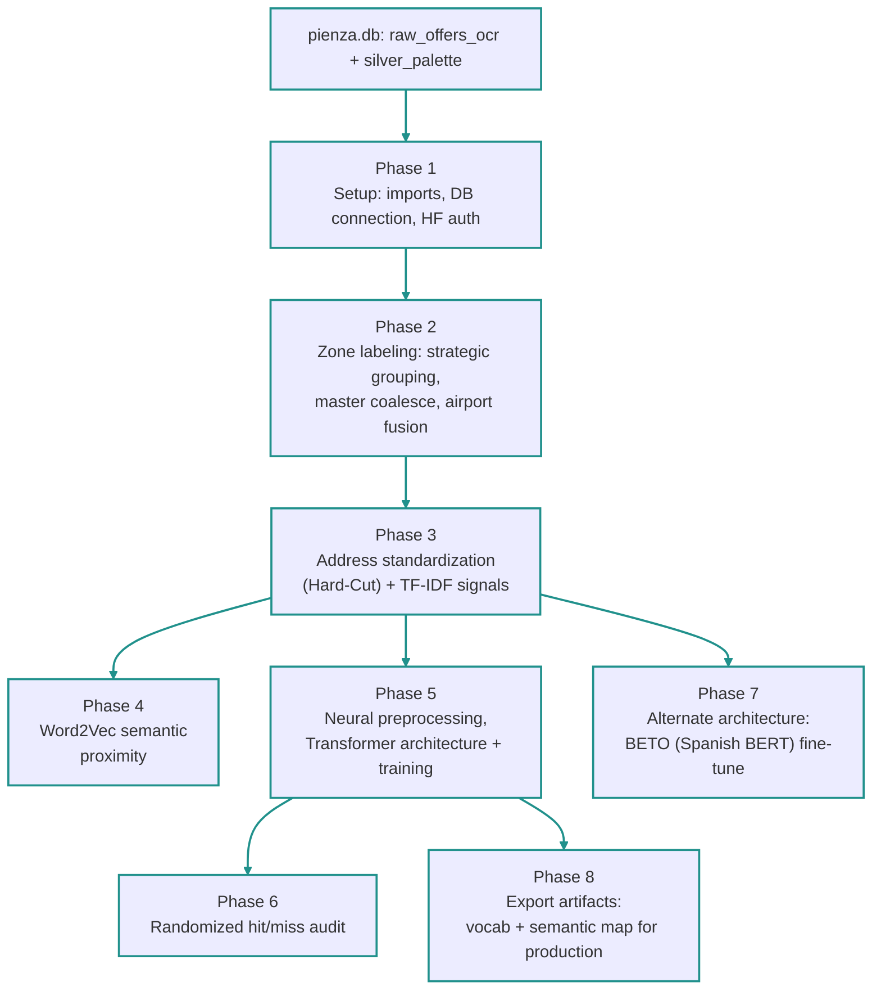
```mermaid
flowchart TD
    A["pienza.db: raw_offers_ocr + silver_palette"] --> P1["Phase 1\nSetup: imports, DB connection, HF auth"]
    P1 --> B["Phase 2\nZone labeling: strategic grouping,\nmaster coalesce, airport fusion"]
    B --> C["Phase 3\nAddress standardization\n(Hard-Cut) + TF-IDF signals"]
    C --> D["Phase 4\nWord2Vec semantic\nproximity"]
    C --> E["Phase 5\nNeural preprocessing,\nTransformer architecture + training"]
    E --> F["Phase 6\nRandomized hit/miss audit"]
    C --> G["Phase 7\nAlternate architecture:\nBETO (Spanish BERT) fine-tune"]
    E --> H["Phase 8\nExport artifacts:\nvocab + semantic map for production"]

    classDef default stroke:#21918c,stroke-width:2px;
    linkStyle default stroke:#21918c,stroke-width:2px;
```

### B. Appendix

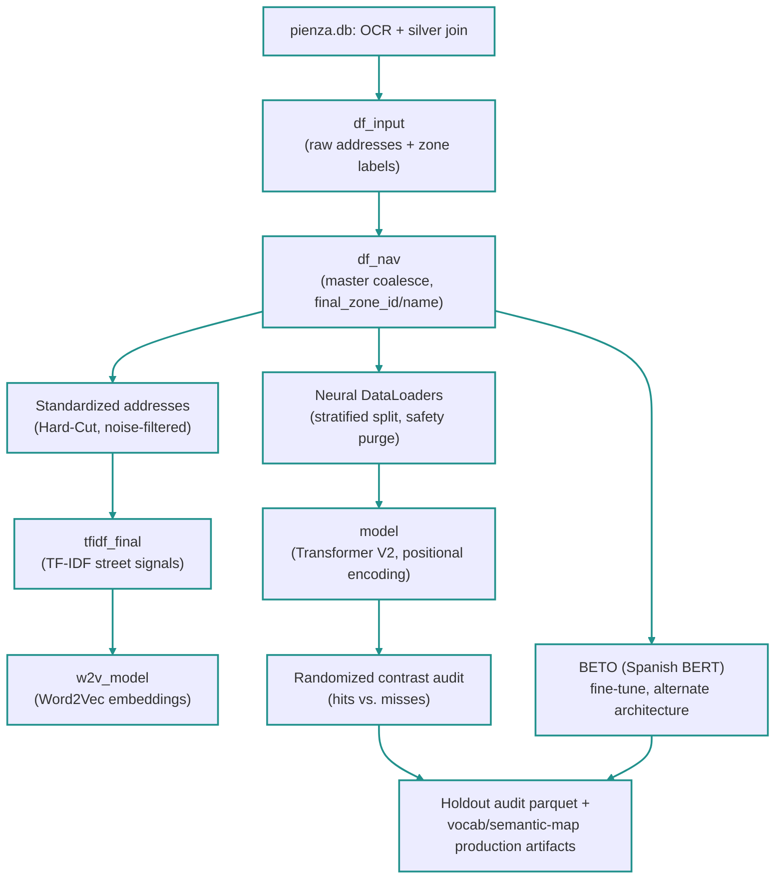
```mermaid
flowchart TD
    ocr["pienza.db: OCR + silver join"] --> df_input["df_input\n(raw addresses + zone labels)"]
    df_input --> df_nav["df_nav\n(master coalesce, final_zone_id/name)"]

    df_nav --> standardized["Standardized addresses\n(Hard-Cut, noise-filtered)"]
    standardized --> tfidf["tfidf_final\n(TF-IDF street signals)"]
    tfidf --> w2v["w2v_model\n(Word2Vec embeddings)"]

    df_nav --> loaders["Neural DataLoaders\n(stratified split, safety purge)"]
    loaders --> model["model\n(Transformer V2, positional encoding)"]
    model --> audit["Randomized contrast audit\n(hits vs. misses)"]

    df_nav --> beto["BETO (Spanish BERT)\nfine-tune, alternate architecture"]

    audit --> exports["Holdout audit parquet +\nvocab/semantic-map production artifacts"]
    beto --> exports

    classDef default stroke:#21918c,stroke-width:2px;
    linkStyle default stroke:#21918c,stroke-width:2px;
```

## 0602_cGAN_Training.ipynb

### A. Inicio

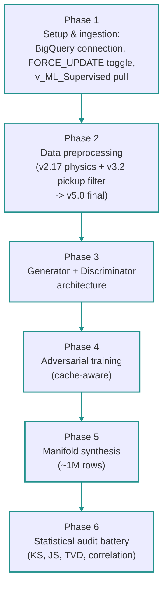
```mermaid
flowchart TD
    P1["Phase 1\nSetup & ingestion:\nBigQuery connection, FORCE_UPDATE toggle,\nv_ML_Supervised pull"] --> B["Phase 2\nData preprocessing\n(v2.17 physics + v3.2 pickup filter\n-> v5.0 final)"]
    B --> C["Phase 3\nGenerator + Discriminator\narchitecture"]
    C --> D["Phase 4\nAdversarial training\n(cache-aware)"]
    D --> E["Phase 5\nManifold synthesis\n(~1M rows)"]
    E --> F["Phase 6\nStatistical audit battery\n(KS, JS, TVD, correlation)"]

    classDef default stroke:#21918c,stroke-width:2px;
    linkStyle default stroke:#21918c,stroke-width:2px;
```

### B. Appendix

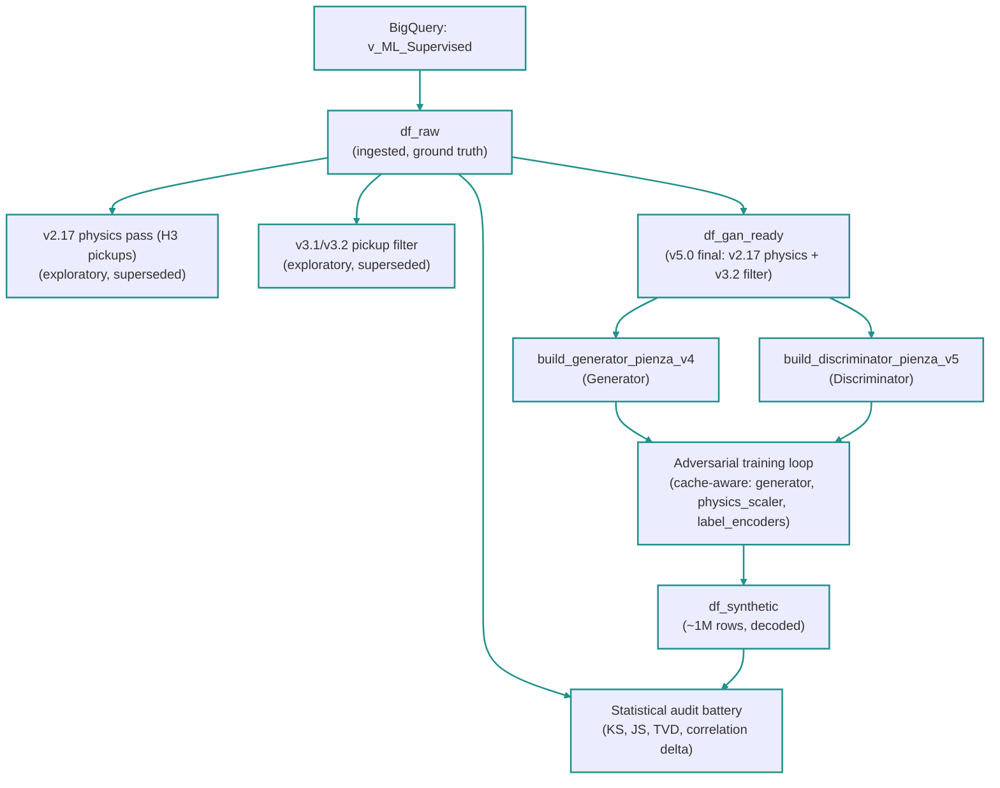
```mermaid
flowchart TD
    bq["BigQuery: v_ML_Supervised"] --> df_raw["df_raw\n(ingested, ground truth)"]

    df_raw --> explore1["v2.17 physics pass (H3 pickups)\n(exploratory, superseded)"]
    df_raw --> explore2["v3.1/v3.2 pickup filter\n(exploratory, superseded)"]
    df_raw --> df_gan_ready["df_gan_ready\n(v5.0 final: v2.17 physics + v3.2 filter)"]

    df_gan_ready --> generator["build_generator_pienza_v4\n(Generator)"]
    df_gan_ready --> discriminator["build_discriminator_pienza_v5\n(Discriminator)"]

    generator --> training["Adversarial training loop\n(cache-aware: generator, physics_scaler, label_encoders)"]
    discriminator --> training

    training --> df_synthetic["df_synthetic\n(~1M rows, decoded)"]

    df_raw --> audits["Statistical audit battery\n(KS, JS, TVD, correlation delta)"]
    df_synthetic --> audits

    classDef default stroke:#21918c,stroke-width:2px;
    linkStyle default stroke:#21918c,stroke-width:2px;
```

## 0603_ETL_pienzadb_to_BigQuery.ipynb

### A. Inicio

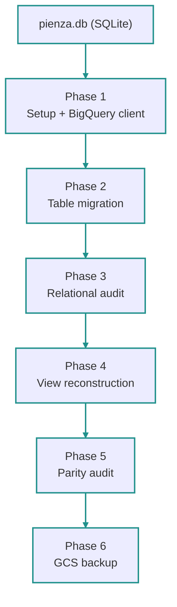
```mermaid
flowchart TD
    A["pienza.db (SQLite)"] --> B["Phase 1\nSetup + BigQuery client"]
    B --> C["Phase 2\nTable migration"]
    C --> D["Phase 3\nRelational audit"]
    D --> E["Phase 4\nView reconstruction"]
    E --> F["Phase 5\nParity audit"]
    F --> G["Phase 6\nGCS backup"]

    classDef default stroke:#21918c,stroke-width:2px;
    linkStyle default stroke:#21918c,stroke-width:2px;
```

### B. Appendix

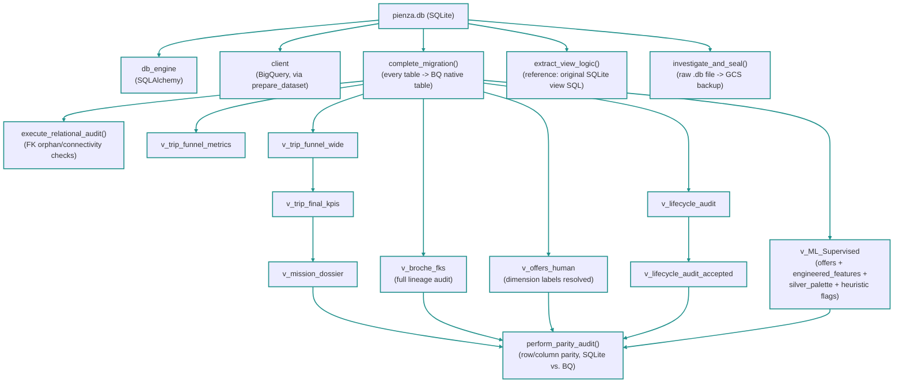
```mermaid
flowchart TD
    sqlite["pienza.db (SQLite)"] --> engine["db_engine\n(SQLAlchemy)"]
    sqlite --> client["client\n(BigQuery, via prepare_dataset)"]

    sqlite --> migration["complete_migration()\n(every table -> BQ native table)"]
    migration --> audit["execute_relational_audit()\n(FK orphan/connectivity checks)"]

    sqlite --> extract["extract_view_logic()\n(reference: original SQLite view SQL)"]

    migration --> funnel_m["v_trip_funnel_metrics"]
    migration --> funnel_w["v_trip_funnel_wide"]
    funnel_w --> kpis["v_trip_final_kpis"]
    kpis --> dossier["v_mission_dossier"]

    migration --> broche["v_broche_fks\n(full lineage audit)"]
    migration --> offers_human["v_offers_human\n(dimension labels resolved)"]

    migration --> lifecycle["v_lifecycle_audit"]
    lifecycle --> lifecycle_accepted["v_lifecycle_audit_accepted"]

    migration --> ml_supervised["v_ML_Supervised\n(offers + engineered_features +\nsilver_palette + heuristic flags)"]

    dossier --> parity["perform_parity_audit()\n(row/column parity, SQLite vs. BQ)"]
    broche --> parity
    offers_human --> parity
    lifecycle_accepted --> parity
    ml_supervised --> parity

    sqlite --> backup["investigate_and_seal()\n(raw .db file -> GCS backup)"]

    classDef default stroke:#21918c,stroke-width:2px;
    linkStyle default stroke:#21918c,stroke-width:2px;
```

## 0604_ETL_cGAN_to_BigQuery.ipynb

### A. Inicio

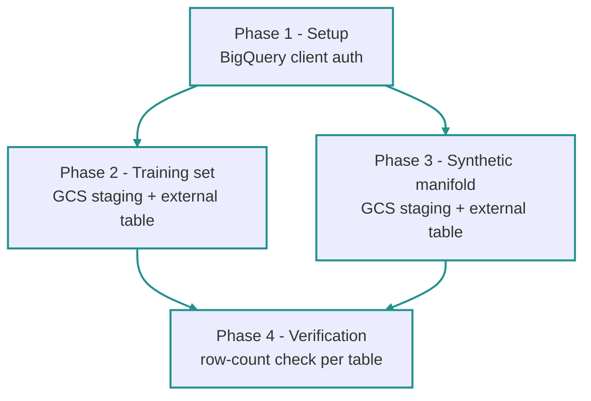
```mermaid
flowchart TD
    P1["Phase 1 - Setup\nBigQuery client auth"] --> P2["Phase 2 - Training set\nGCS staging + external table"]
    P1 --> P3["Phase 3 - Synthetic manifold\nGCS staging + external table"]
    P2 --> P4["Phase 4 - Verification\nrow-count check per table"]
    P3 --> P4

    classDef default stroke:#21918c,stroke-width:2px;
    linkStyle default stroke:#21918c,stroke-width:2px;
```

### B. Appendix

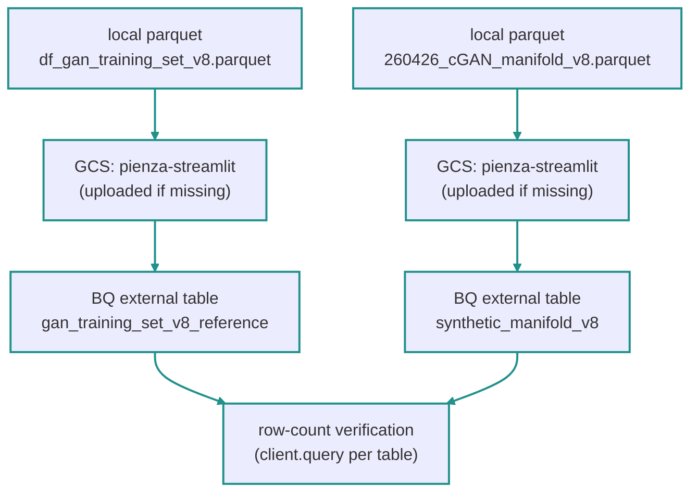
```mermaid
flowchart TD
    local_a["local parquet\ndf_gan_training_set_v8.parquet"] --> gcs_a["GCS: pienza-streamlit\n(uploaded if missing)"]
    gcs_a --> bq_a["BQ external table\ngan_training_set_v8_reference"]

    local_b["local parquet\n260426_cGAN_manifold_v8.parquet"] --> gcs_b["GCS: pienza-streamlit\n(uploaded if missing)"]
    gcs_b --> bq_b["BQ external table\nsynthetic_manifold_v8"]

    bq_a --> verify["row-count verification\n(client.query per table)"]
    bq_b --> verify

    classDef default stroke:#21918c,stroke-width:2px;
    linkStyle default stroke:#21918c,stroke-width:2px;
```

## 0605_cGAN_denormalization.ipynb

### A. Inicio

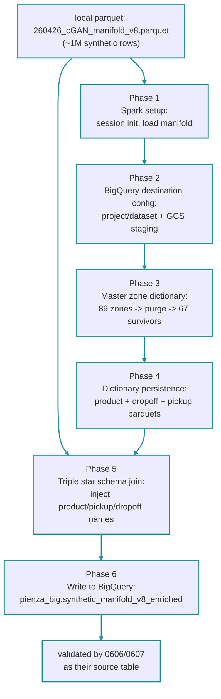
```mermaid
flowchart TD
    A["local parquet: 260426_cGAN_manifold_v8.parquet\n(~1M synthetic rows)"] --> P1["Phase 1\nSpark setup:\nsession init, load manifold"]
    P1 --> P2["Phase 2\nBigQuery destination config:\nproject/dataset + GCS staging"]
    P2 --> B["Phase 3\nMaster zone dictionary:\n89 zones -> purge -> 67 survivors"]
    B --> C["Phase 4\nDictionary persistence:\nproduct + dropoff + pickup parquets"]
    A --> D["Phase 5\nTriple star schema join:\ninject product/pickup/dropoff names"]
    C --> D
    D --> E["Phase 6\nWrite to BigQuery:\npienza_big.synthetic_manifold_v8_enriched"]
    E --> F["validated by 0606/0607\nas their source table"]

    classDef default stroke:#21918c,stroke-width:2px;
    linkStyle default stroke:#21918c,stroke-width:2px;
```

### B. Appendix

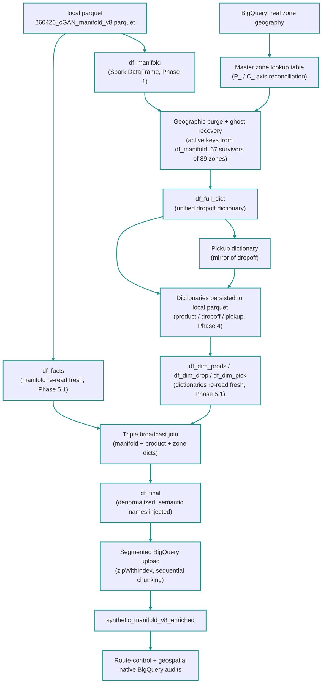
```mermaid
flowchart TD
    local_pq["local parquet\n260426_cGAN_manifold_v8.parquet"] --> df_manifold["df_manifold\n(Spark DataFrame, Phase 1)"]

    bq_zones["BigQuery: real zone geography"] --> lookup["Master zone lookup table\n(P_ / C_ axis reconciliation)"]
    df_manifold --> purge["Geographic purge + ghost recovery\n(active keys from df_manifold, 67 survivors of 89 zones)"]
    lookup --> purge
    purge --> df_full_dict["df_full_dict\n(unified dropoff dictionary)"]
    df_full_dict --> df_pickup_dict["Pickup dictionary\n(mirror of dropoff)"]

    df_full_dict --> dict_parquets["Dictionaries persisted to local parquet\n(product / dropoff / pickup, Phase 4)"]
    df_pickup_dict --> dict_parquets

    local_pq --> df_facts["df_facts\n(manifold re-read fresh, Phase 5.1)"]
    dict_parquets --> df_dims["df_dim_prods / df_dim_drop / df_dim_pick\n(dictionaries re-read fresh, Phase 5.1)"]

    df_facts --> join["Triple broadcast join\n(manifold + product + zone dicts)"]
    df_dims --> join
    join --> df_final["df_final\n(denormalized, semantic names injected)"]

    df_final --> upload["Segmented BigQuery upload\n(zipWithIndex, sequential chunking)"]
    upload --> table["synthetic_manifold_v8_enriched"]
    table --> validate["Route-control + geospatial\nnative BigQuery audits"]

    classDef default stroke:#21918c,stroke-width:2px;
    linkStyle default stroke:#21918c,stroke-width:2px;
```

## 0606_cGAN_downscaling.ipynb

### A. Inicio

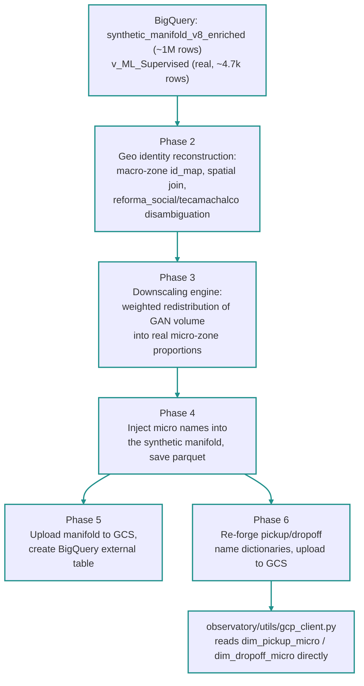
```mermaid
flowchart TD
    A["BigQuery: synthetic_manifold_v8_enriched (~1M rows)\nv_ML_Supervised (real, ~4.7k rows)"] --> B["Phase 2\nGeo identity reconstruction:\nmacro-zone id_map, spatial join,\nreforma_social/tecamachalco disambiguation"]
    B --> C["Phase 3\nDownscaling engine:\nweighted redistribution of GAN volume\ninto real micro-zone proportions"]
    C --> D["Phase 4\nInject micro names into\nthe synthetic manifold, save parquet"]
    D --> E["Phase 5\nUpload manifold to GCS,\ncreate BigQuery external table"]
    D --> F["Phase 6\nRe-forge pickup/dropoff\nname dictionaries, upload to GCS"]
    F --> G["observatory/utils/gcp_client.py\nreads dim_pickup_micro / dim_dropoff_micro directly"]

    classDef default stroke:#21918c,stroke-width:2px;
    linkStyle default stroke:#21918c,stroke-width:2px;
```

### B. Appendix

```mermaid
flowchart TD
    bq["BigQuery ingest\n(macro zones, real + synthetic)"] --> df_real["df_real, df_synthetic\n(macro-zone level)"]
    df_real --> gdf["gdf_polygons\n(micro polygons, topological disambiguation)"]
    gdf --> joined["joined\n(macro-to-micro id_map)"]

    joined --> mini_agg["df_mini_dropoffs, df_mini_pickups\n(outer-join aggregation)"]
    mini_agg --> downscale["Downscaling engine\n(guarded rounding, macro totals preserved)"]
    downscale --> audit["Fidelity audit (1:1)\n+ targeted zone checks"]

    audit --> df_synthetic_final["df_synthetic\n(down-mapped manifold, micro names injected)"]
    df_synthetic_final --> gcs["GCS upload +\nBQ external table"]

    df_synthetic_final --> dicts["df_dim_pick_final, df_dim_drop_final\n(semantic dictionaries, micro-resolution)"]
    dicts --> gcs_dicts["Uploaded to GCS\n(read by observatory/utils/gcp_client.py)"]

    classDef default stroke:#21918c,stroke-width:2px;
    linkStyle default stroke:#21918c,stroke-width:2px;
```

## 0607_cGAN_TSTR.ipynb

### A. Inicio

```mermaid
flowchart TD
    A["BigQuery: v_ML_Supervised (real)\nsynthetic_manifold_v8_enriched (synthetic)"] --> B["Phase 1\nBlueprint: features + target"]
    B --> C["Phase 2\nTRTR: extract, unify products,\ntrain on real W1-5, evaluate on real W6"]
    C --> D["trtr_f1 (baseline)"]
    C --> E["Phase 3\nTSTR: train on synthetic manifold,\nevaluate on same real W6 holdout"]
    E --> F["tstr_f1 (challenger)"]
    D --> G["Predictive parity verdict\ntstr_f1 / trtr_f1"]
    F --> G
    classDef default stroke:#21918c,stroke-width:2px;
    linkStyle default stroke:#21918c,stroke-width:2px;
```

### B. Appendix

```mermaid
flowchart TD
    real["BigQuery: v_ML_Supervised\n(real, W1-6)"] --> holdout["df_holdout_real\n(Week 6 chronological split)"]
    real --> traintrue["Weeks 1-5 (train)"]
    synth["BigQuery: synthetic_manifold_v8_enriched"] --> df_synth["df_synth\n(product tiers unified)"]

    traintrue --> le_L1["le_L1\n(target encoder, shared)"]
    df_synth --> y_synth_encoded["y_synth_encoded\n(le_L1.transform)"]
    le_L1 --> y_synth_encoded

    traintrue --> model_trtr["model_bouncer_TRTR\n(trained on real W1-5)"]
    model_trtr --> holdout_eval["X_test_L1_TRTR, y_test_L1_TRTR\n(from df_holdout_real)"]
    holdout_eval --> trtr_f1["trtr_f1 (baseline)"]

    y_synth_encoded --> model_tstr["model_bouncer_TSTR\n(trained on synthetic)"]
    model_tstr --> tstr_eval["predict on same\nX_test_L1_TRTR holdout"]
    tstr_eval --> tstr_f1["tstr_f1 (challenger)"]

    trtr_f1 --> verdict["Predictive parity verdict\ntstr_f1 / trtr_f1"]
    tstr_f1 --> verdict

    classDef default stroke:#21918c,stroke-width:2px;
    linkStyle default stroke:#21918c,stroke-width:2px;
```

## 0608_Bridge_to_Markov_Network_Graph.ipynb

### A. Inicio

```mermaid
flowchart TD
    A["poly.geojson + manual routes"] --> P1["Phase 1\nSetup and node geometry\n(gdf_nodes, gdf_f)"]
    P1 --> B["Phase 2\nPhysical graph\n(topology, centrality, resilience)"]
    C["Synthetic manifold (0607/0606)"] --> D["Phase 3\nClosed-system filter\n(unassigned-zone removal)"]
    D --> E["Phase 4\nMobility tensor -> functional graph\n(EPH-weighted, 72x72, flow asymmetry)"]
    B --> F["Phase 5\nMarkov bridge\n(Bellman, optimal policy, fleet sim)"]
    E --> F
    F --> G["Phase 6\nExport for Kepler / PyDeck"]

    classDef default stroke:#21918c,stroke-width:2px;
    linkStyle default stroke:#21918c,stroke-width:2px;
```

### B. Appendix

```mermaid
flowchart TD
    poly["poly.geojson"] --> gdf_nodes["gdf_nodes\n(72 polygons + centroids)"]
    gdf_nodes --> gdf_f["gdf_f\n(filtered to route-mentioned zones)"]

    routes["36 manual routes"] --> G_manual["G_manual\n(physical undirected graph)"]
    gdf_f --> G_manual

    manifold["synthetic manifold (0607/0606)"] --> df_synth["df_synth\n(EPH computed, geofence-filtered)"]
    G_manual --> df_synth

    df_synth --> mobility_tensor["mobility_tensor\n(72x72xHxDxP, 2 channels)"]
    mobility_tensor --> W_master["W_master\n(72x72 volume-weighted EPH)"]
    W_master --> G_functional["G_functional\n(directed functional graph)"]

    mobility_tensor --> P_ij["P_ij / R_ij\n(transition + reward matrices)"]
    P_ij --> V["V(s)\n(Bellman value iteration)"]
    V --> Q_ij["Q_ij\n(action-value matrix)"]
    Q_ij --> df_policy["df_policy\n(optimal policy pi*)"]
    Q_ij --> fleet_sim["fleet deployment simulator\n(demand-depletion routing)"]

    mobility_tensor --> df_arcos["df_arcos\n(all active routes + coordinates, vol_ij from tensor,\npositions from G_manual)"]
    G_manual --> df_arcos
    df_arcos --> csv_v1["CSV: tensor_arcos_mvp"]
    csv_v1 --> csv_v2["CSV: + edge_betweenness/closeness/pagerank\n(G_functional rebuilt from mobility_tensor)"]
    G_functional --> csv_v2
    csv_v2 --> csv_v3["CSV: + masa_economica/eph_maestro (final)"]

    classDef default stroke:#21918c,stroke-width:2px;
    linkStyle default stroke:#21918c,stroke-width:2px;
```

🚩 0407 A — encontré drift real, dos errores:

pienza.db: offers está conectado a Phase 1 en vez de Phase 2. El source dice A2["pienza.db: offers"] --> C["Phase 2\nHDBSCAN clustering..."] — pero en el PNG la línea de "pienza.db: offers" entra a la caja de Phase 1, no a Phase 2.
Falta el edge directo Phase 2 → Phase 4. El source tiene C --> E (Phase 2 alimenta tanto a Phase 3 como directamente a Phase 4, en paralelo con D --> E), pero el PNG solo muestra la cadena lineal 1→2→3→4→5, sin la rama extra.
O sea: en el diagrama real, Phase 2 (HDBSCAN) tiene dos entradas (poly.geojson vía Phase 1, y offers directo) y dos salidas (a Phase 3 y a Phase 4 en paralelo) — el PNG lo aplanó a una cadena simple de una sola vía, perdiendo la estructura real del pipeline.

Sigo revisando el resto y te doy la lista completa al final, pero este ya es un caso confirmado a corregir antes de aplicarlo al notebook.

⚠️ 0509 A — el contenido y las conexiones internas de las 3 fases son correctas, pero faltan los títulos de los subgraphs ("Phase 1 - Data Foundry", "Phase 2 - Layer 1 (Triage)", "Phase 3 - Layer 2 (Nuance)"). El source usa subgraph P1["Phase 1 - Data Foundry"] etc., y el PNG muestra las 3 cajas punteadas agrupadoras pero sin su etiqueta de título visible — se pierde el nombre de cada fase macro. No es un dato inventado, es una omisión de contexto. Lo anoto como hallazgo menor (no bloqueante como el de 0407 A, pero sí a corregir si es fácil).

🚩 0509 B — dos discrepancias más:

Falta el edge directo df_input → features. El source tiene df_input --> zones Y df_input --> features (dos salidas paralelas desde df_input), más zones --> features. El PNG lo aplanó a una cadena lineal simple df_input → zones → features, con una sola línea de entrada a "Wide + Focused raw universes" — mismo patrón de "achatado" que vimos en 0407 A.

xgb_spartan aparece conectado a X_test_l2, pero en el source es un nodo terminal (hoja) sin salidas. Solo model_champion_L2 --> X_test_l2 existe en el source; xgb_spartan se entrena pero no alimenta nada más downstream. El PNG muestra ambas cajas (model_champion_L2 y xgb_spartan) convergiendo hacia X_test_l2, fabricando una conexión que no existe.

Resto del diagrama (bifurcación en X_L1/X_L2, cadena L1, convergencia final a shap_values_L2) correcto.

⚠️ 0603 B — el más denso (17 nodos), y sospecho drift adicional consistente con el patrón ya visto.

Verificado correcto: pienza.db → 5 hijos (db_engine, client, complete_migration, extract_view_logic, investigate_and_seal) ✓; complete_migration() → 7 hijos (audit, funnel_metrics, funnel_wide, broche_fks, offers_human, lifecycle_audit, ML_Supervised) ✓; v_trip_funnel_wide → v_trip_final_kpis ✓.

Lo que no puedo confirmar con certeza visual al 100% (imagen muy densa): el source dice que 5 nodos convergen en perform_parity_audit() — v_mission_dossier, v_broche_fks, v_offers_human, v_lifecycle_audit_accepted, y v_ML_Supervised (este último con un edge largo que salta directo desde arriba). En el PNG solo veo una flecha clara entrando a perform_parity_audit() (desde v_mission_dossier) — las otras 4 líneas parecen perderse o desviarse hacia v_mission_dossier/v_lifecycle_audit_accepted en el camino, en vez de llegar directo a parity. Es el mismo patrón de "edges perdidos en la convergencia final" que ya confirmé en 0407 A y 0509 B.

Este es el diagrama más propenso a error de todo el lote — recomiendo pedirle a Design que lo revise con especial cuidado, o regenerarlo aparte.

🚩 0605 A — mismo patrón de drift: falta el edge directo local parquet → Phase 5.

El source tiene A --> D (el parquet local alimenta directamente la Fase 5 "Triple star schema join", en paralelo con la cadena principal A → Fase1 → ... → Fase4 → D) — o sea Fase 5 tiene dos padres (el parquet crudo Y la Fase 4). El PNG lo muestra como una cadena lineal pura de 8 pasos, sin la rama directa. Ya van 3-4 diagramas con este mismo patrón exacto de "se pierde el edge de atajo/convergencia cuando también existe una cadena secuencial" — parece un problema sistemático del pipeline de Design, no casos aislados.

🚩 0605 B — dos problemas más, mismo patrón sistemático:

Falta el edge directo df_full_dict → dict_parquets. El source dice que df_full_dict alimenta tanto a df_pickup_dict como directamente a dict_parquets (dos salidas paralelas). El PNG solo muestra la ruta vía df_pickup_dict, perdiendo la conexión directa.

La línea larga de df_facts parece terminar mal. Por el source, df_facts (que viene directo del parquet local, saltándose varios nodos intermedios) debería llegar hasta Triple broadcast join mucho más abajo. En el PNG, esa línea larga parece cortarse y entrar equivocadamente a Pickup dictionary en su lugar — dejando a Triple broadcast join con una sola entrada (df_dims) en vez de las dos que le corresponden (df_facts + df_dims).

Esto ya es el 5to caso del mismo patrón: cada vez que un diagrama tiene una "línea larga" que se salta varios nodos en paralelo con la cadena secuencial principal, Design la pierde o la mete en el nodo equivocado. Vale la pena reportárselo a Claude Design como patrón sistemático, no solo corregir diagrama por diagrama.

🚩 0607 A — otro caso del mismo patrón: convergencia final rota.

El source dice que tanto trtr_f1 (baseline) como tstr_f1 (challenger) alimentan independientemente a Predictive parity verdict (D-->G, F-->G, dos edges paralelos). En el PNG, la línea de trtr_f1 no llega hasta el verdict — parece desviarse y entrar a la caja de tstr_f1 en su lugar, y el verdict final solo recibe una flecha (desde tstr_f1). Mismo patrón de convergencias perdidas/mal-enrutadas que ya van 6 veces en este lote.

🚩 0608 B — el diagrama más grande (19 nodos) y con errores confirmados de conexión:

36 manual routes está conectado a gdf_nodes en vez de G_manual. El source dice routes --> G_manual (routes alimenta el grafo físico, no la geometría de nodos). En el PNG, "36 manual routes" entra a gdf_nodes junto con poly.geojson, lo cual no es lo que dice el source.

synthetic manifold (0607/0606) parece terminar en gdf_f en vez de df_synth. Es otro edge "de salto largo" (source: manifold --> df_synth, saltándose gdf_f y G_manual) que aparenta cortarse antes de tiempo — mismo patrón que ya confirmamos en 0605 B y 0607 A.

Como consecuencia, G_manual y df_synth probablemente están recibiendo menos padres de los que deberían (les faltan routes y manifold respectivamente).

Dada la complejidad de este diagrama (el más grande del lote) y que ya encontré 2 errores confirmados sin siquiera verificar el resto pixel por pixel con certeza total, recomiendo pedirle a Design que lo regenere completo en vez de solo parchear — es el que más riesgo tiene de errores adicionales no detectados.

