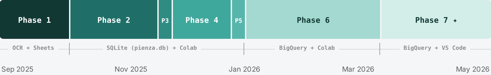

<div align="center">

[](https://github.com/WiseExMachina/pienza)
[](https://linkedin.com/in/bernardolw)

<table><tr valign="middle">
<td valign="middle"></td>
<td valign="middle" align="left">
<h2>Project Pienza</h2>
<sub><b>DIGITAL TWIN · CDMX</b></sub>
</td>
</tr></table>

*An ML framework to navigate Mexico City's ride-hailing marketplace*


</div>

---

## What this is

Project Pienza is a research project grounded in the operational reality of Mexico City's streets — two years driving in the ride-hailing gig economy, turned into a formal Data Science study. Rather than relying on public, aggregated datasets from cities like San Francisco or New York, the project builds its own ground-truth dataset from scratch: a six-week field capture of 4,700 real ride offers, each labeled in real time. (full story here → [STORY.md](./STORY.md))

| | |
|---|---|
| **It is** | a policy-cloning research project — testing whether a model can learn one expert's accept/reject heuristics well enough to explain them, not just predict them. |
| **It is not** | an attempt to reverse-engineer or audit any ride-hailing platform's pricing or dispatch algorithm. The platform is the environment; the driver executing that policy is the agent under study. |
| **Scope** | N=1 by design — single driver, single city, six weeks. Findings describe one expert's policy, not driver behavior in general. |

> **Tech Stack:** Python · XGBoost · HDBSCAN · PyTorch · TensorFlow/Keras · SQLite → BigQuery · Streamlit · Kepler.gl · H3 · GCS

## Results at a glance

| | |
|---|---|
| **Real offers captured (OCR)** | 4,700 |
| **Completed trips (field-logged)** | 256 |
| **Acceptance rate** | 7% |
| **Geo hubs discovered (post-cleanup)** | 44, across 72 hand-drawn microzones |
| **Cascade XGBoost vs. logistic regression** | outperforms — confirms a nonlinear component in the decision policy |
| **miniBabel (address → zone transformer)** | 84% accuracy, local inference, replaces a paid geocoding API call |
| **Synthetic market (cGAN)** | 1,001,001 rows, hosted in GCS, queried via BigQuery |


<sub><i>44 HDBSCAN results (height = offer density) validated against 72 hand-drawn polygons. Color = cluster ID — full hub names and metrics are available via hover in the live Observatory dashboard.</i></sub>

## Timeline



```
├── 1. Acquisition & Ground Truth       GTS WebApp + Gemini OCR
├── 2. Data Engineering                ETL → absolute SSoT from 0211_ETL_Big_Bang onward
├── 3. Exploratory Analysis            Causal inference on marketplace physics
├── 4. Unsupervised ML                 HDBSCAN clustering (44 hubs / 72 microzones)
├── 5. Supervised ML                   Cascade Classifier — Naive Bayes → LogReg → XGBoost
├── 6. Generative Moonshots
│   ├── miniBabel                      NLP transformer, address → zone
│   ├── cGAN                           1M-row synthetic manifold → BigQuery
│   └── Network Graph / Mobility Tensor MDP scaffolding
└── 7. The Observatory                 Streamlit — interactive white paper
```

Intermediate Parquet/CSV outputs between notebooks live in `data/dumped_files/` — ephemeral, safe to delete and regenerate at any time.

## Repository structure

<details>
<summary><b>Click to expand full tree</b></summary>

```
pienza/
├── README.md                        # you are here
├── STORY.md                         # the narrative — how and why this got built
├── The_Pienza_Papers/
│   ├── Pienza_Papers_Scientific.pdf # full technical writeup
│   └── Pienza_Papers_Executive/     # business-facing summary
│
├── research_core/                   # curated spine notebooks (numbered for traceability)
│   ├── 0211_ETL_Big_Bang_pienzadb.ipynb
│   ├── 0305_EDA_Causal_Inference.ipynb
│   ├── 0307_EDA_Optimal_Stopping_Playbook.ipynb
│   ├── 0403_KMeans_Raw.ipynb
│   ├── 0407_Clustering_Paper_Streamlit.ipynb
│   ├── 0509_WINNER_XGB_cascade_postablation.ipynb
│   ├── 0601_NLP_Transformer_miniBabel.ipynb
│   ├── 0602_cGAN_Training.ipynb
│   └── 0603–0608_*.ipynb            # BigQuery bridge + Markov/graph scaffolding
│
├── research_archive/                # full phase-by-phase history
│   ├── Phase_1_Acquisition_and_Ground_Truth/
│   ├── Phase_2_Data_Engineering/    # ETL, temporal ledger, geospatial reconciliation
│   ├── Phase_3_Exploratory_Analysis/
│   ├── Phase_4_Unsupervised_ML/     # PCA, KMeans, HDBSCAN, polygon zones
│   ├── Phase_5_Supervised_ML/       # Naive Bayes → LogReg → XGBoost tournament
│   └── Phase_6_Generative_Moonshots/# miniBabel, cGAN, BigQuery migration
│
├── data/
│   ├── pienza.db                    # SQLite SSoT (real data)
│   └── dumped_files/                # ephemeral intermediate artifacts
│
├── observatory/                     # 🔭 the Streamlit app
│   ├── main.py                      # home page + canonical sidebar
│   ├── pages/                       # 000X_Name.py (view) + _000X_data.py (model)
│   ├── components/                  # styles.py — GLOBAL_CSS
│   ├── utils/                       # bq_client.py, gcp_client.py
│   └── assets/                      # static, shareable assets
│
├── assets/                           # tracked README/portfolio images
└── assets_ignored/                   # private repo context/docs (gitignored)
```

</details>

## Links

- 🔭 **[Live Observatory dashboard](#)** — placeholder, add live Streamlit URL
- 📄 **[Pienza Papers (Scientific)](./The_Pienza_Papers/Pienza_Papers_Scientific.pdf)**
- 📖 **[STORY.md](./STORY.md)** — the full narrative, with links to the notebooks at the moments they mattered
