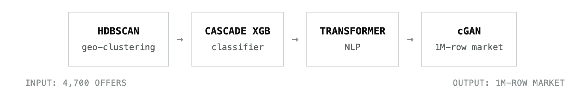
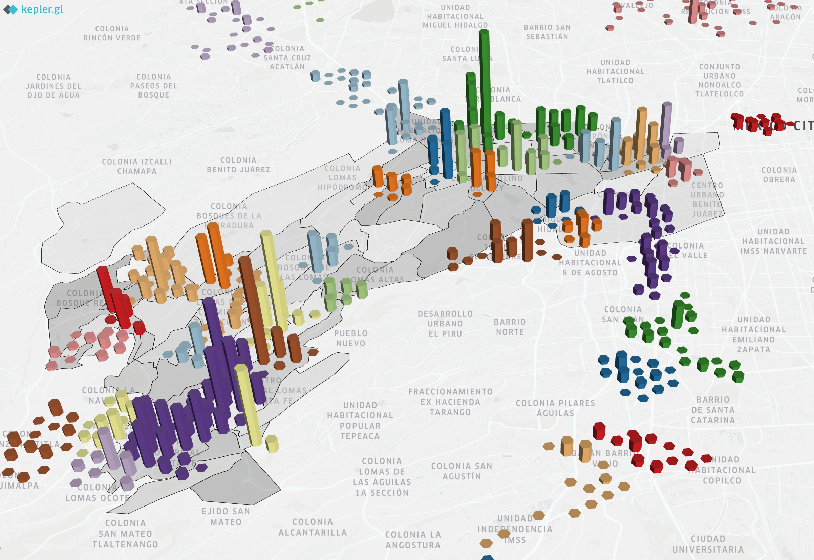
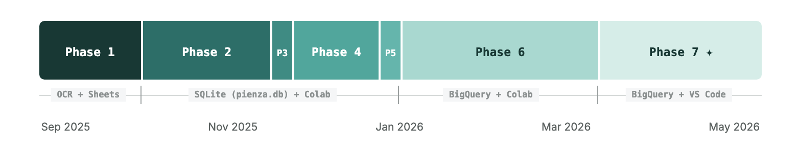

<div align="center">

[](https://github.com/WiseExMachina/pienza)
[](https://linkedin.com/in/bernardolw)


*An ML framework to navigate Mexico City's ride-hailing marketplace*



</div>

---

## Overview

Project Pienza is a research project grounded in the operational reality of Mexico City's streets. It grew out of two years driving in the ride-hailing gig economy, formalized into a year-long Data Science study. Rather than relying on public, aggregated datasets from cities like San Francisco or New York, the project builds its own ground-truth dataset from scratch: a six-week field capture of 4,700 real ride offers, each labeled in real time. (full story here → [STORY.md](./STORY.md))

**It is** — a policy-cloning research project — testing whether a model can learn one expert's heuristics well enough to explain them, not just predict them.

**It is not** — an attempt to reverse-engineer or audit any ride-hailing platform's pricing or dispatch algorithm. The platform is the environment; the driver executing that policy is the agent under study.

**Scope** — N=1 by design — single driver, single city, six weeks. Findings describe one expert's policy, not driver behavior in general.

<sub><b>Tech Stack:</b> Python · XGBoost · HDBSCAN · PyTorch · TensorFlow/Keras · SQLite → BigQuery · Streamlit · Kepler.gl · H3 · GCS</sub>


<sub><i>44 HDBSCAN results (height = offer density) validated against 72 hand-drawn polygons. Color = cluster ID — full hub names and metrics are available via hover in the live Observatory dashboard.</i></sub>

## Interacting with the Project

There are three ways into this project, depending on how deep you want to go:

1. **The Observatory (Streamlit app)** — an interactive white paper, built so both technical and non-technical readers can explore the project's core findings without opening the repo or reading a line of code. This isn't a prototype dashboard — it's a full replica of the project's results.
   Live app: [pienza.streamlit.app](#) *(placeholder)*

2. **LLM-readable white paper** — a LaTeX-authored technical paper structured for machine context rather than linear human reading. Feed it to an LLM to ask FAQ-style questions about the project's methodology and findings.
   [View PDF](#) · [Download PDF](#) *(placeholders)*

3. **The repository itself** — full source, notebooks, and pipeline. Structure explained below.

## Repository structure

### Top Level

```
pienza/
├── README.md                # you are here
├── STORY.md                 # the narrative — how and why this got built
├── The_Pienza_Papers/       # LaTeX white paper (Scientific + Executive)
├── notebooks_core/          # curated spine notebooks (numbered for traceability)
├── notebooks_full/          # full phase-by-phase history (40+ notebooks)
├── observatory/             # the Streamlit app
└── assets/                  # tracked README/portfolio images
```

### Core Notebooks

```
notebooks_core/
├── 0102_GTS_index.html                          # Engine 1 — GTS WebApp
├── 0208_Stateful_Features_AppsScript.js          # stateful feature capture
├── 0211_ETL_Big_Bang_pienzadb.ipynb              # ETL → absolute SSoT (pienza.db)
├── 0305_EDA_Causal_Inference.ipynb               # payout structure, residual analysis
├── 0307_EDA_Optimal_Stopping_Playbook.ipynb      # rational wait-time / selectivity analysis
├── 0403_KMeans_Raw.ipynb                         # early unsupervised pass, pre-geo-cleanup
├── 0407_Clustering_Paper_Streamlit.ipynb         # HDBSCAN, 44 hubs / 72 microzones (final)
├── 0509_WINNER_XGB_cascade_postablation.ipynb    # champion cascade classifier
├── 0601_NLP_Transformer_miniBabel.ipynb          # address → zone transformer, 84% acc
├── 0602_cGAN_Training.ipynb                      # conditional GAN, synthetic offer generator
├── 0603_ETL_pienzadb_to_BigQuery.ipynb           # bridge: SQLite → BigQuery
├── 0604_ETL_cGAN_to_BigQuery.ipynb               # bridge: synthetic manifold → BigQuery
├── 0605_cGAN_denormalization.ipynb               # rescale synthetic outputs to real units
├── 0606_cGAN_downscaling.ipynb                   # Apache Spark, obviously
├── 0607_cGAN_TSTR.ipynb                          # Train-Synthetic-Test-Real validation
└── 0608_Bridge_to_Markov_Network_Graph.ipynb     # network graph + MDP scaffolding
```

### Full Notebooks

```
notebooks_full/
├── Phase_1_Acquisition_and_Ground_Truth/    # GTS WebApp (2 files)
├── Phase_2_Data_Engineering/                # ETL, temporal ledger, geospatial reconciliation (16 files)
├── Phase_3_Exploratory_Analysis/            # univariate/bivariate EDA, causal inference (8 files)
├── Phase_4_Unsupervised_ML/                 # PCA, KMeans, HDBSCAN, polygon zones (8 files)
├── Phase_5_Supervised_ML/                   # Naive Bayes → LogReg → XGBoost tournament (10 files)
└── Phase_6_Generative_Moonshots/            # miniBabel, cGAN, BigQuery migration (8 files)
```

### Observatory (Streamlit App)

```
observatory/
├── main.py                  # home page + canonical sidebar
├── config.py                # page config, favicon
├── _main_data.py            # main.py's data/model sibling
├── pages/                   # 000X_Name.py (view) + _000X_data.py (model), 9 pages
├── components/              # styles.py — GLOBAL_CSS
├── utils/                   # bq_client.py, gcp_client.py — BigQuery/GCS fetchers
└── assets/                  # static, shareable assets (favicon, PDFs, HTML maps)
```

## Timeline



```
├── 1. Acquisition & Ground Truth
├── 2. Data Engineering
├── 3. Exploratory Analysis
├── 4. Unsupervised ML
├── 5. Supervised ML
├── 6. Generative Moonshots
└── 7. The Observatory
```

Intermediate Parquet/CSV outputs between notebooks live in `data/dumped_files/` — ephemeral, safe to delete and regenerate at any time.
